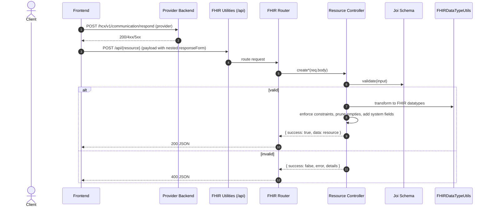

# HCX Integration Toolkit

Utility tools to facilitate HCX Integrations

## Monorepo Structure

```
monorepo/
├── apps/
│   ├── hcx-ui/
│   ├── provider-stub/
│   └── payer-stub/
├── services/
│   ├── insurance-plan-converter/
│   └── fhir-utilities/
├── packages/
│   ├── fhir-core/
│   ├── hcx-client/
│   └── ui-components/
├── docs/
│   └── static/
├── config/
│   ├── eslint.config.js
│   ├── jest.config.js
│   └── tsconfig.base.json
├── tools/
│   ├── generate-docs.ts
│   ├── seed-db.ts
│   └── hcx-simulator.ts
├── docker/
│   ├── docker-compose.dev.yaml
│   ├── Dockerfile.ui
│   ├── Dockerfile.converter
│   └── Dockerfile.fhir-utils
├── .github/
├── pnpm-workspace.yaml
├── turbo.json
├── package.json
└── README.md
```

## Workspace Setup

- Uses [pnpm](https://pnpm.io/) for fast, disk-efficient dependency management.
- Uses [Turborepo](https://turbo.build/) for high-performance monorepo builds, caching, and task orchestration.

## Getting Started

1. Install [pnpm](https://pnpm.io/installation) and [Turborepo](https://turbo.build/).
2. Run `pnpm install` at the root to install all dependencies.
3. Use `pnpm build`, `pnpm dev`, `pnpm lint`, and `pnpm test` to run tasks across the monorepo.

## Service Ports

| Service                      | Port  | Environment Variable | Description                             |
| ---------------------------- | ----- | -------------------- | --------------------------------------- |
| HCX UI                       | 8081  | `PORT=8081`          | Frontend web interface                  |
| Payer Stub                   | 3001  | `PORT=3001`          | Mock service for payer systems          |
| Provider Stub                | 4001  | `PORT=4001`          | Mock service for provider systems       |
| FHIR Utilities               | 4002  | `PORT=4002`          | FHIR resource utilities and validation  |
| Insurance Plan Converter API | 5001  | `PORT=5001`          | Converts insurance plans to FHIR format |
| MongoDB                      | 27017 | -                    | Database service                        |

## Structure

- `apps/`: Runnable applications (UI, stubs)
- `services/`: API/microservices
- `packages/`: Shared libraries
- `docs/`: Documentation
- `config/`: Shared configuration
- `tools/`: Internal CLI/dev tools
- `docker/`: Dockerfiles and Compose setups
- `.github/`: GitHub Actions, templates, workflows

## CI/CD

- GitHub Actions workflows in `.github/workflows/` for build, lint, and test.
- Remote caching and task orchestration via Turborepo.

---

# Certificate Generation for NHCX Participants

This section explains how to generate X.509 RSA certificates for NHCX participants, which are required for secure communication.

### Step 1: Generate a 2048-bit RSA Private Key

```bash
openssl genpkey -algorithm RSA -out private.key -pkeyopt rsa_keygen_bits:2048
```

This command generates a `private.key` file containing an RSA Private Key.

### Step 2: Create a Certificate Signing Request (CSR)

```bash
openssl req -new -key private.key -out request.csr
```

When prompted, provide the following details:

- Country Name (2 letter code)
- State or Province Name
- Locality Name
- Organization Name
- Organizational Unit Name
- Common Name (e.g., your domain or participant ID)
- Email Address
- Optional challenge password

This generates a `request.csr` file.

### Step 3: Generate a Self-Signed X.509 Certificate

```bash
openssl x509 -req -in request.csr -signkey private.key -out certificate.crt -days 365
```

This creates a self-signed X.509 certificate (`certificate.crt`) valid for 365 days.

### Step 4: Base64 Encode the Certificate

Encode the certificate using a base64 encoder. You can use the following command:

```bash
base64 -i certificate.crt -o certificate.base64
```

Or use an online tool like [Base64 Encoder](https://www.base64encode.org/).

### Sample X.509 Certificate

```
-----BEGIN CERTIFICATE-----
MIID0zCCArugAwIBAgIUaxmygMvtb6JvQyB19mvjr2cd7fowDQYJKoZIhvcNAQEL
BQAweTELMAkGA1UEBhMCSU4xEjAQBgNVBAgMCUpoYXJraGFuZDEQMA4GA1UEBwwH
RGhhbmJhZDELMAkGA1UECgwCTkExCzAJBgNVBAsMAk5BMQswCQYDVQQDDAJOQTEd
MBsGCSqGSIb3DQEJARYOdGVzdEBlbWFpbC5jb20wHhcNMjUwNzEzMTkyMDA4WhcN
MjYwNzEzMTkyMDA4WjB5MQswCQYDVQQGEwJJTjESMBAGA1UECAwJSmhhcmtoYW5k
MRAwDgYDVQQHDAdEaGFuYmFkMQswCQYDVQQKDAJOQTELMAkGA1UECwwCTkExCzAJ
BgNVBAMMAk5BMR0wGwYJKoZIhvcNAQkBFg50ZXN0QGVtYWlsLmNvbTCCASIwDQYJ
KoZIhvcNAQEBBQADggEPADCCAQoCggEBAKOdFMDNqlAmLICcy2CKcA27Da+dEUj2
VhTv5eSRfS5vq+2IJ3OhRyMvGHL3ReqdH0SPiOLzbPH9pe2AdUBdWMv+uoaGumZo
c3+G1+3f1Mu/i2GYJpLSG2p781egxXbqSTaHHlqT46KIz3b+E0+dWtkC6T6PWIdQ
S4eNTZzVW+xErWcVy/+/MhnNkGzpr7HlTuj8lyRm9ZofvVioVQEo0lcbdthRHHw1
fgUu6WubGypIcvZi2LjbJ6D+bdwttu/o661zmndyo+T6FSIa+AHEgUSWIlxO+QJB
iY0b59UNBKvQe7Sr5E+8bNE2nQ8n9GAkmDFQhUoTfBiA25hFka8Q7V0CAwEAAaNT
MFEwHQYDVR0OBBYEFLKMAjFPnbVSbRW5UuNO1AZnsypgMB8GA1UdIwQYMBaAFLKM
AjFPnbVSbRW5UuNO1AZnsypgMA8GA1UdEwEB/wQFMAMBAf8wDQYJKoZIhvcNAQEL
BQADggEBAAdzgVXWU1zlSQqv0Fi8KWs9dtT+mMA0nwz5Y68Z95kbHqB3UC9VLGsu
wJIXPMQ/ViojN7IjLOK3uTr6BjbNdI0fVIzJHFPHYuWmQGIa7keHh7egBbAkp1EG
oYXXkmlwlif+gyLxnwQxRdgXJvz2bQb0I5zLDSCIuYM5KcpL6Pu9+NDlcoxrafuV
3T289PUZexmJE1zqksy5gYlyiujdxaJGLPkQ/FV9vynZyc9S7jBBmHmttDw8BaVX
MBpSm1AWyg1iiCqwPZsK7WypWEXO/lFY/FdwIUHFyC5QPe2usPyAqO0vMJxCjqy1
5KO9n3b+37/gDJA/EzJLyuNLSypykPU=
-----END CERTIFICATE-----
```

---

## Directory Structure for certificates and keys

For both Payer and Provider stubs, certificates and keys should be stored in the following directory structure:

```
HCX-Integration-Toolkit/
├── apps/
│   ├── payer-stub/
│   │   └── keys/
│   │       ├── payer_private.pem    # Private key
│   │       ├── payer_cert.pem       # Certificate in PEM format
│   │       └── provider_cert.pem    # Counterparty's certificate
│   └── provider-stub/
│       └── keys/
│           ├── provider_private.pem # Private key
│           ├── provider_cert.pem    # Certificate in PEM format
│           └── payer_cert.pem       # Counterparty's certificate
```

### File Naming Conventions

1. **Payer Stub**:

   - Private Key: `payer-stub/keys/payer_private.pem`
   - Certificate: `payer-stub/keys/payer_cert.pem`
   - Counterparty Certificate: `payer-stub/keys/provider_cert.pem`

2. **Provider Stub**:
   - Private Key: `provider-stub/keys/provider_private.pem`
   - Certificate: `provider-stub/keys/provider_cert.pem`
   - Counterparty Certificate: `provider-stub/keys/payer_cert.pem`

## Environment Variables

### Common Variables

| Variable          | Required | Default                     | Description                                                   |
| ----------------- | -------- | --------------------------- | ------------------------------------------------------------- |
| `NODE_ENV`        | No       | `development`               | Application environment (`development`, `production`, `test`) |
| `PORT`            | No       | Service-specific            | Port on which the service will run                            |
| `LOG_LEVEL`       | No       | `info`                      | Logging level (`error`, `warn`, `info`, `debug`)              |
| `LOG_PRETTY`      | No       | `1` in dev                  | Pretty print logs (set to `0` for JSON)                       |
| `LOG_MAX_VAL_LEN` | No       | `5000`                      | Maximum length of log values                                  |
| `MONGO_URL_DEV`   | No       | `mongodb://localhost:27017` | MongoDB connection URL for development                        |
| `MONGO_DB_NAME`   | No       | `hcx-toolkit`               | MongoDB database name                                         |

### Payer Stub

| Variable                    | Required | Default                             | Description                              |
| --------------------------- | -------- | ----------------------------------- | ---------------------------------------- |
| `PORT`                      | No       | `3001`                              | Port for the Payer Stub service          |
| `HCX_SENDER_CODE`           | Yes      | -                                   | Payer's HCX participant code             |
| `HCX_RECIPIENT_CODE`        | Yes      | -                                   | Default recipient's HCX participant code |
| `HCX_BEN_ABHA_ID`           | Yes      | -                                   | Beneficiary ABHA ID                      |
| `HCX_WORKFLOW_ID`           | No       | -                                   | Workflow ID for tracking                 |
| `NHCX_BASE_URL`             | Yes      | `https://apisbx.abdm.gov.in/hcx/v1` | Base URL for NHCX API                    |
| `RECIPIENT_PUBLIC_KEY_PATH` | Yes      | -                                   | Path to recipient's public key           |

### Provider Stub

| Variable                    | Required | Default                             | Description                                              |
| --------------------------- | -------- | ----------------------------------- | -------------------------------------------------------- |
| `PORT`                      | No       | `4001`                              | Port for the Provider Stub service                       |
| `PROVIDER_CODE`             | Yes      | -                                   | Provider's HCX participant code (e.g., `1000004178@hcx`) |
| `PAYER_CODE`                | Yes      | -                                   | Payer's HCX participant code (e.g., `1000004161@hcx`)    |
| `NHCX_BASE_URL`             | No       | `https://apisbx.abdm.gov.in/hcx/v1` | Base URL for NHCX API                                    |
| `NHCX_API_KEY`              | Yes      | -                                   | API key for NHCX authentication                          |
| `PROVIDER_PRIVATE_KEY_PATH` | Yes      | -                                   | Path to provider's private key                           |
| `RECIPIENT_PUBLIC_KEY_PATH` | Yes      | -                                   | Path to recipient's public key                           |

### ABDM Integration

| Variable             | Required | Default                                                 | Description                   |
| -------------------- | -------- | ------------------------------------------------------- | ----------------------------- |
| `ABDM_CLIENT_ID`     | Yes      | -                                                       | ABDM client ID                |
| `ABDM_CLIENT_SECRET` | Yes      | -                                                       | ABDM client secret            |
| `ABDM_GRANT_TYPE`    | No       | `client_credentials`                                    | OAuth grant type              |
| `SESSION_API_URL`    | Yes      | `https://dev.abdm.gov.in/api/hiecm/gateway/v3/sessions` | ABDM session API URL          |
| `ABDM_TOKEN_URL`     | No       | Same as `SESSION_API_URL`                               | ABDM token URL (if different) |

### Example .env File

```env
# --- Runtime ---
NODE_ENV=development
PORT=4001

# --- MongoDB (adjust if needed) ---
MONGO_URL_DEV=mongodb://localhost:27017/hcx_provider

# --- NHCX gateway ---
NHCX_BASE_URL=https://apisbx.abdm.gov.in/hcx/v1

# --- ABDM Session (Provider) ---
ABDM_CLIENT_ID=your_abdm_client_id
ABDM_CLIENT_SECRET=your_abdm_client_secret
ABDM_GRANT_TYPE=client_credentials

SESSION_API_URL=https://dev.abdm.gov.in/api/hiecm/gateway/v3/sessions
ABDM_TOKEN_URL=https://dev.abdm.gov.in/api/hiecm/gateway/v3/sessions

# --- HCX participant codes ---
PROVIDER_CODE=1000004178@hcx
PAYER_CODE=1000004161@hcx

# --- Crypto / keys (if used by provider) ---
PROVIDER_PRIVATE_KEY_PATH=./keys/provider_private.pem
RECIPIENT_PUBLIC_KEY_PATH=./keys/payer_cert.pem
```

## Local Development with ngrok

### What is ngrok?

[ngrok](https://ngrok.com/) is a tool that creates secure tunnels to localhost, making your local development server accessible over the internet. This is essential for testing webhook integrations with the NHCX sandbox.

### Setup ngrok for NHCX Integration

#### 1. Install ngrok

```bash
# On macOS (using Homebrew)
brew install ngrok

# On Windows (using Chocolatey)
choco install ngrok

# On Linux
snap install ngrok
# OR
sudo apt install ngrok
# OR download from https://ngrok.com/download
```

#### 2. Authenticate ngrok

1. Sign up at [ngrok](https://dashboard.ngrok.com/signup) if you haven't already
2. Get your authtoken from the [dashboard](https://dashboard.ngrok.com/get-started/your-authtoken)
3. Authenticate:
   ```bash
   ngrok config add-authtoken <YOUR_AUTH_TOKEN>
   ```

#### 3. Configure ngrok

We've included an `ngrok.yml` configuration file in the project root that sets up tunnels for both Payer and Provider stubs. Here's what the configuration looks like:

```yaml
version: '2'
authtoken: ${NGROK_AUTH_TOKEN} # Set this in your environment or replace with your token

# Payer Stub Configuration
tunnels:
  payer-stub:
    addr: 3001
    proto: http
    host_header: payer-stub.local
    bind_tls: true
    inspect: true

  # Provider Stub Configuration
  provider-stub:
    addr: 4001
    proto: http
    host_header: provider-stub.local
    bind_tls: true
    inspect: true

# Global web interface for monitoring all tunnels
web_addr: localhost:4040
```

1. Set your ngrok authtoken as an environment variable or edit the `ngrok.yml` file:

   ```bash
   # Set as environment variable (recommended)
   export NGROK_AUTH_TOKEN='your_auth_token_here'

   # Or edit the ngrok.yml file and replace ${NGROK_AUTH_TOKEN} with your token
   ```

2. Start all tunnels with a single command:

   ```bash
   ngrok start --all --config=ngrok.yml
   ```

   This will start both tunnels:

   - Payer Stub on port 3001
   - Provider Stub on port 4001

3. The web interface at http://localhost:4040 will show both tunnels and their public URLs.

# FHIR Utilities Service

A scalable FHIR microservice for creating, validating, and managing FHIR resources. This service is part of the HCX Integration Toolkit and targets HL7 FHIR R4 (4.0.1) with support for:

- **NRCES IG** (v6.5.0)
- **NHCX IG** (v0.7.0)

The service ensures compliance with the specified FHIR version and implementation guides, including required profiles, extensions, and value sets.

## Getting Started

### Prerequisites

- Docker and Docker Compose (recommended)
- OR Node.js 16+ with npm 8+ or yarn 1.22+

### Installation with Docker

1. Ensure Docker and Docker Compose are installed on your system
2. Clone the repository:
   ```bash
   git clone https://github.com/hustlernik/HCX-Integration-Toolkit.git
   ```
3. Navigate to the `fhir-utilities` directory:
   ```bash
   cd HCX-Integration-Toolkit/services/fhir-utilities
   ```
4. Build and start the service:
   ```bash
   docker-compose up --build
   ```
   For running in detached mode:
   ```bash
   docker-compose up -d --build
   ```

### Manual Installation

1. Clone the repository:
   ```bash
   git clone https://github.com/hustlernik/HCX-Integration-Toolkit.git
   ```
2. Navigate to the `fhir-utilities` directory:
   ```bash
   cd HCX-Integration-Toolkit/services/fhir-utilities
   ```
3. Install the dependencies:
   ```bash
   npm install
   ```
4. Start the service:
   ```bash
   npm start
   ```

## Available Scripts

```bash
# Run in production mode
npm start

# Run in development mode with hot-reloading
npm run dev

# Lint code
npm run lint

# Lint and automatically fix issues
npm run lint:fix
```

## API Endpoints

| Endpoint                                  | Method | Description                                      |
| ----------------------------------------- | ------ | ------------------------------------------------ |
| `/health`                                 | GET    | Service health check                             |
| `/api/claim`                              | POST   | Create or validate a Claim resource              |
| `/api/claim/schema`                       | GET    | Get Claim resource schema                        |
| `/api/claimresponse`                      | POST   | Create or validate a ClaimResponse resource      |
| `/api/claimresponse/schema`               | GET    | Get ClaimResponse schema                         |
| `/api/coverage`                           | POST   | Create or validate a Coverage resource           |
| `/api/coverage/schema`                    | GET    | Get Coverage resource schema                     |
| `/api/coverageeligibilityrequest`         | POST   | Create or validate a CoverageEligibilityRequest  |
| `/api/coverageeligibilityrequest/schema`  | GET    | Get CoverageEligibilityRequest schema            |
| `/api/coverageeligibilityresponse`        | POST   | Create or validate a CoverageEligibilityResponse |
| `/api/coverageeligibilityresponse/schema` | GET    | Get CoverageEligibilityResponse schema           |
| `/api/insuranceplan`                      | POST   | Create or validate an InsurancePlan resource     |
| `/api/insuranceplan/schema`               | GET    | Get InsurancePlan schema                         |
| `/api/patient`                            | POST   | Create or validate a Patient resource            |
| `/api/patient/schema`                     | GET    | Get Patient resource schema                      |
| `/api/paymentnotice`                      | POST   | Create or validate a PaymentNotice resource      |
| `/api/paymentnotice/schema`               | GET    | Get PaymentNotice schema                         |
| `/api/paymentreconciliation`              | POST   | Create or validate a PaymentReconciliation       |
| `/api/paymentreconciliation/schema`       | GET    | Get PaymentReconciliation schema                 |
| `/api/task`                               | POST   | Create or validate a Task resource               |
| `/api/task/schema`                        | GET    | Get Task resource schema                         |

**Note:** The service runs on port `4002` by default.

## Creating FHIR Resources

### Example: Creating a Patient Resource

```javascript
// Example request to create a Patient
const patientData = {
  resourceType: 'Patient',
  identifier: [
    {
      system: 'https://nrces.in/ndhm/fhir/r4/CodeSystem/ndhm-identifier-type-code',
      value: 'patient-123',
    },
  ],
  name: [
    {
      use: 'official',
      family: 'Doe',
      given: ['John'],
    },
  ],
  gender: 'male',
  birthDate: '1990-01-01',
  telecom: [
    {
      system: 'phone',
      value: '+919876543210',
      use: 'mobile',
    },
  ],
  address: [
    {
      line: ['123 Main St'],
      city: 'Bangalore',
      state: 'Karnataka',
      postalCode: '560001',
      country: 'IN',
    },
  ],
};

// Using fetch API
const response = await fetch('http://localhost:4002/api/patient', {
  method: 'POST',
  headers: {
    'Content-Type': 'application/json',
  },
  body: JSON.stringify(patientData),
});

const result = await response.json();
console.log(result);
```

### Example: Creating a CoverageEligibilityRequest

```javascript
const eligibilityRequest = {
  status: 'active',
  purpose: ['validation'],
  patient: {
    reference: 'Patient/patient-123',
  },
  created: new Date().toISOString(),
  provider: {
    reference: 'Organization/org-123',
  },
  insurer: {
    reference: 'Organization/insurer-123',
  },
  insurance: [
    {
      coverage: {
        reference: 'Coverage/coverage-123',
      },
    },
  ],
  item: [
    {
      category: {
        coding: [
          {
            system: 'http://terminology.hl7.org/CodeSystem/ex-benefitcategory',
            code: 'medical',
            display: 'Medical Care',
          },
        ],
      },
    },
  ],
};

const response = await fetch('http://localhost:4002/api/coverage-eligibility-request', {
  method: 'POST',
  headers: {
    'Content-Type': 'application/json',
  },
  body: JSON.stringify(eligibilityRequest),
});
```

## API Endpoints Reference

### FHIR Utilities Service (Port 4002)

| Endpoint                                  | Method | Description                                      |
| ----------------------------------------- | ------ | ------------------------------------------------ |
| `/health`                                 | GET    | Service health check                             |
| `/api/claim`                              | POST   | Create or validate a Claim resource              |
| `/api/claim/schema`                       | GET    | Get Claim resource schema                        |
| `/api/claimresponse`                      | POST   | Create or validate a ClaimResponse resource      |
| `/api/claimresponse/schema`               | GET    | Get ClaimResponse schema                         |
| `/api/coverage`                           | POST   | Create or validate a Coverage resource           |
| `/api/coverage/schema`                    | GET    | Get Coverage resource schema                     |
| `/api/coverageeligibilityrequest`         | POST   | Create or validate a CoverageEligibilityRequest  |
| `/api/coverageeligibilityrequest/schema`  | GET    | Get CoverageEligibilityRequest schema            |
| `/api/coverageeligibilityresponse`        | POST   | Create or validate a CoverageEligibilityResponse |
| `/api/coverageeligibilityresponse/schema` | GET    | Get CoverageEligibilityResponse schema           |
| `/api/insuranceplan`                      | POST   | Create or validate an InsurancePlan resource     |
| `/api/insuranceplan/schema`               | GET    | Get InsurancePlan schema                         |
| `/api/patient`                            | POST   | Create or validate a Patient resource            |
| `/api/patient/schema`                     | GET    | Get Patient resource schema                      |
| `/api/paymentnotice`                      | POST   | Create or validate a PaymentNotice resource      |
| `/api/paymentnotice/schema`               | GET    | Get PaymentNotice schema                         |
| `/api/paymentreconciliation`              | POST   | Create or validate a PaymentReconciliation       |
| `/api/paymentreconciliation/schema`       | GET    | Get PaymentReconciliation schema                 |
| `/api/task`                               | POST   | Create or validate a Task resource               |
| `/api/task/schema`                        | GET    | Get Task resource schema                         |

### Payer Stub (Port 3001)

#### NHCX Protocol Endpoints

| Endpoint                               | Method | Description                                 |
| -------------------------------------- | ------ | ------------------------------------------- |
| `/hcx/v1/session`                      | POST   | Authentication and session management       |
| `/hcx/v1/coverageeligibility/on_check` | POST   | Handle coverage eligibility check responses |
| `/hcx/v1/claim/adjudicate`             | POST   | Process claim adjudication requests         |
| `/hcx/v1/communication/request`        | POST   | Handle communication requests               |
| `/hcx/v1/communication/on_request`     | POST   | Handle communication responses              |
| `/hcx/v1/error`                        | POST   | Handle error responses                      |

#### FHIR Resource Endpoints

| Endpoint                 | Method           | Description                             |
| ------------------------ | ---------------- | --------------------------------------- |
| `/InsurancePlan`         | GET, POST        | List or create InsurancePlan resources  |
| `/InsurancePlan/:id`     | GET, PUT, DELETE | Manage specific InsurancePlan           |
| `/InsurancePlan/_search` | GET              | Search InsurancePlans                   |
| `/insurance-plans`       | GET, POST        | Alternative endpoint for InsurancePlans |
| `/insurance-plans/:id`   | GET, PUT, DELETE | Manage specific InsurancePlan           |
| `/policies`              | GET, POST        | List or create policies                 |
| `/policies/:id`          | GET, PUT, DELETE | Manage specific policy                  |
| `/beneficiaries`         | GET, POST        | List or create beneficiaries            |
| `/beneficiaries/:id`     | GET, PUT, DELETE | Manage specific beneficiary             |

### Provider Stub (Port 4001)

#### NHCX Protocol Endpoints

| Endpoint                              | Method | Description                           |
| ------------------------------------- | ------ | ------------------------------------- |
| `/hcx/v1/session`                     | POST   | Authentication and session management |
| `/hcx/v1/insuranceplan/request`       | POST   | Request insurance plan information    |
| `/hcx/v1/coverageeligibility/request` | POST   | Submit coverage eligibility request   |
| `/hcx/v1/coverageeligibility/check`   | POST   | Check coverage eligibility status     |
| `/hcx/v1/claim/submit`                | POST   | Submit a claim                        |
| `/hcx/v1/claim/on_submit`             | POST   | Handle claim submission responses     |
| `/hcx/v1/communication/request`       | POST   | Initiate communication                |
| `/hcx/v1/communication/on_request`    | POST   | Handle incoming communications        |
| `/hcx/v1/communication/respond`       | POST   | Respond to communications             |
| `/hcx/v1/communication/inbox`         | GET    | Get communication inbox               |
| `/v1/error/response`                  | POST   | Handle error responses                |

#### Management Endpoints

| Endpoint                  | Method | Description                |
| ------------------------- | ------ | -------------------------- |
| `/api/communications`     | GET    | List all communications    |
| `/api/communications/:id` | GET    | Get specific communication |
| `/hcx/v1/transactions`    | GET    | List all transactions      |

### Insurance Plan Converter (Port 5001)

| Endpoint                     | Method | Description                                |
| ---------------------------- | ------ | ------------------------------------------ |
| `/`                          | GET    | Service status                             |
| `/api/insuranceplan/convert` | POST   | Convert insurance plan data to FHIR format |
| `/api/test-json`             | POST   | Test endpoint for JSON processing          |

## Validation

All resources are validated against FHIR R4 specifications and NHCX-specific profiles. The service will return detailed error messages if validation fails.

### Example Error Response

```json
{
  "success": false,
  "error": "Validation failed",
  "details": [
    "patient.reference: Missing required property",
    "insurance[0].coverage.reference: Missing required property"
  ]
}
```

## Viewing Resource Schemas

You can view the input schema for any resource by making a GET request to the schema endpoint:

```bash
# Get schema for Patient resource
curl http://localhost:4002/api/patient/schema

# Get schema for CoverageEligibilityRequest
curl http://localhost:4002/api/coverage-eligibility-request/schema
```

## Testing with Examples

Example input files are available in the `sampleInputs/` directory. These can be used to test the various endpoints.

## External Validation

For additional validation, you can use the official FHIR validator:

[https://validator.fhir.org/](https://validator.fhir.org/)

## How It Works

The service follows these steps to process FHIR resources:

1. **Input Validation**: Validates the input against the defined Joi schemas
2. **Transformation**: Converts simplified input to FHIR-compliant resources
3. **Constraint Enforcement**: Ensures all required fields and constraints are met
4. **Response**: Returns the validated and transformed FHIR resource

### Request Flow



## NHCX Compliance

When working with NHCX, ensure your resources include the required extensions and conform to the NHCX Implementation Guide. Pay special attention to:

- Required identifiers and references
- Mandatory extensions for NHCX
- Proper coding systems and value sets
- FHIR profiles specified in the NHCX IG

## Insurance Plan Converter

### Overview

The Insurance Plan Converter is a tool designed to convert insurance plan documents (PDF/Excel) into FHIR InsurancePlan resources. It provides both a backend API for document processing and a frontend interface for easy interaction.

### Features

- Convert PDF/Excel insurance documents to FHIR InsurancePlan resources
- Support for multiple LLM providers (OpenAI, Google Vertex AI)
- Web-based interface for easy document upload and conversion

### Backend API

#### Endpoints

- `POST /api/insuranceplan/convert` - Convert uploaded document to FHIR InsurancePlan
  - Accepts: `multipart/form-data` with file in `inputFile` field
  - Returns: JSON containing FHIR InsurancePlan resource(s)

#### Environment Variables

| Variable                         | Required    | Default          | Description                         |
| -------------------------------- | ----------- | ---------------- | ----------------------------------- |
| `PORT`                           | No          | `5001`           | Port for the backend server         |
| `NODE_ENV`                       | No          | `development`    | Runtime environment                 |
| `LLM_PROVIDER`                   | No          | `openai`         | LLM provider (`openai` or `google`) |
| `OPENAI_API_KEY`                 | Conditional | -                | Required if using OpenAI            |
| `GOOGLE_APPLICATION_CREDENTIALS` | Conditional | -                | Path to GCP service account key     |
| `GOOGLE_CLOUD_PROJECT`           | Conditional | -                | GCP project ID (Vertex AI)          |
| `GOOGLE_CLOUD_LOCATION`          | No          | `us-central1`    | GCP location                        |
| `VERTEX_MODEL`                   | No          | `gemini-2.5-pro` | Vertex AI model name                |

### Frontend

The frontend is a React-based web application that provides a user-friendly interface for the Insurance Plan Converter.

#### Features

- Drag-and-drop file upload
- Real-time conversion status
- Display of converted FHIR resources
- Copy/download functionality for results

#### Environment Variables

| Variable            | Required | Default                 | Description     |
| ------------------- | -------- | ----------------------- | --------------- |
| `VITE_API_BASE_URL` | No       | `http://localhost:5001` | Backend API URL |

### Development Setup

#### Backend

1. Install dependencies:
   ```bash
   cd services/insurance-plan-converter/packages/backend
   npm install
   ```
2. Create `.env` file based on `.env.example`
3. Start development server:
   ```bash
   npm run dev
   ```

#### Frontend

1. Install dependencies:
   ```bash
   cd services/insurance-plan-converter/packages/frontend
   npm install
   ```
2. Configure environment variables if needed
3. Start development server:
   ```bash
   npm run dev
   ```

### Usage

1. Access the frontend (default: http://localhost:8080)
2. Upload a PDF or Excel file containing insurance plan information
3. Wait for the conversion to complete
4. View, copy, or download the resulting FHIR InsurancePlan resource

### API Integration

Example cURL request:

```bash
curl -X POST http://localhost:5001/api/insuranceplan/convert \
  -H "Content-Type: multipart/form-data" \
  -F "inputFile=@path/to/insurance_plan.pdf"
```

### Supported Document Formats

- PDF documents containing structured insurance plan information
- Excel spreadsheets (.xlsx, .xls) with insurance plan data

### Dependencies

- Backend: Node.js, Express, Multer, PDF-parse, xlsx, Google Vertex AI/OpenAI SDK
- Frontend: React, Vite, Tailwind CSS, Radix UI
