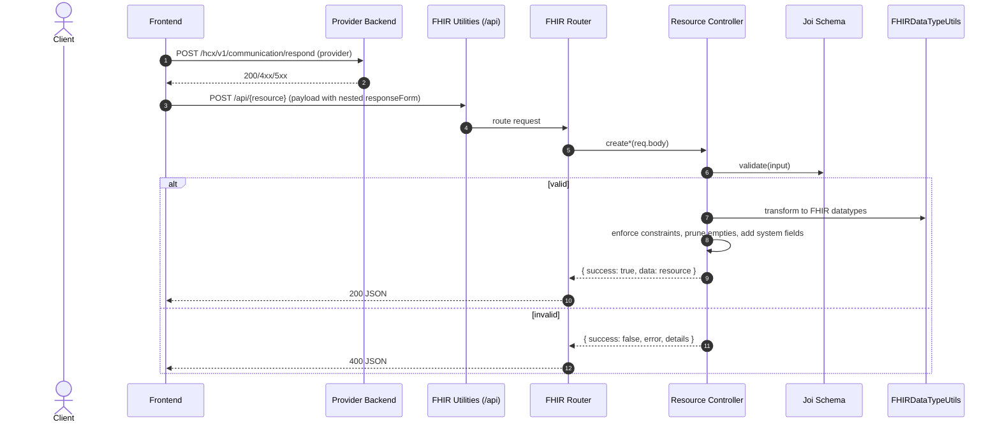

# FHIR Utilities Service

A scalable FHIR microservice for creating, validating, and managing FHIR resources. This service is part of the HCX Integration Toolkit and targets HL7 FHIR R4 (4.0.1) with support for:

- **NRCES IG** (v6.5.0)
- **NHCX IG** (v0.7.0)

The service ensures compliance with the specified FHIR version and implementation guides, including required profiles, extensions, and value sets.

## Getting Started

### Prerequisites

- Docker and Docker Compose (recommended)
- OR Node.js 18+ with npm 9+ or yarn 1.22+

### Installation with Docker

1. Ensure Docker and Docker Compose are installed on your system
2. Clone the repository:
   ```bash
   git clone https://github.com/hustlernik/HCX-Integration-Toolkit.git
   ```
3. Navigate to the `fhir-utilities` directory:
   ```bash
   cd HCX-Integration-Toolkit/services/fhir-utilities
   ```
4. Build and start the service:
   ```bash
   docker-compose up --build
   ```
   For running in detached mode:
   ```bash
   docker-compose up -d --build
   ```

### Manual Installation

1. Clone the repository:
   ```bash
   git clone https://github.com/hustlernik/HCX-Integration-Toolkit.git
   ```
2. Navigate to the `fhir-utilities` directory:
   ```bash
   cd HCX-Integration-Toolkit/services/fhir-utilities
   ```
3. Install the dependencies:
   ```bash
   npm install
   ```
4. Start the service:
   ```bash
   npm start
   ```

## Available Scripts

```bash
# Run in production mode
npm start

# Run in development mode with hot-reloading
npm run dev

# Lint code
npm run lint

# Lint and automatically fix issues
npm run lint:fix
```

## API Endpoints

| `/api/patient` | POST | Create a Patient resource |
| `/api/patient/schema` | GET | Get Patient input schema |
| `/api/claim` | POST | Create a Claim resource |
| `/api/claim/schema` | GET | Get Claim input schema |
| `/api/claim-response` | POST | Create a ClaimResponse resource |
| `/api/claim-response/schema` | GET | Get ClaimResponse input schema |
| `/api/coverage-eligibility-request` | POST | Create a CoverageEligibilityRequest |
| `/api/coverage-eligibility-request/schema` | GET | Get CoverageEligibilityRequest schema |
| `/api/coverage-eligibility-response` | POST | Create a CoverageEligibilityResponse |
| `/api/coverage-eligibility-response/schema`| GET | Get CoverageEligibilityResponse schema |
| `/api/insurance-plan` | POST | Create an InsurancePlan resource |
| `/api/insurance-plan/schema` | GET | Get InsurancePlan input schema |
| `/api/coverage` | POST | Create a Coverage resource |
| `/api/coverage/schema` | GET | Get Coverage input schema |
| `/api/task` | POST | Create a Task resource |
| `/api/task/schema` | GET | Get Task input schema |
| `/api/payment-notice` | POST | Create a PaymentNotice resource |
| `/api/payment-notice/schema` | GET | Get PaymentNotice input schema |
| `/api/payment-reconciliation` | POST | Create a PaymentReconciliation resource |
| `/api/payment-reconciliation/schema` | GET | Get PaymentReconciliation input schema |

**Note:** The service runs on port `4002` by default.

## Creating FHIR Resources

### Example: Creating a Patient Resource

```javascript
// Example request to create a Patient
const patientData = {
  resourceType: 'Patient',
  identifier: [
    {
      system: 'https://nrces.in/ndhm/fhir/r4/CodeSystem/ndhm-identifier-type-code',
      value: 'patient-123',
      type: {
        coding: [
          {
            system: 'https://nrces.in/ndhm/fhir/r4/CodeSystem/ndhm-identifier-type-code',
            code: 'ABHA',
            display: 'Ayushman Bharat Health Account',
          },
        ],
      },
    },
  ],
  name: [
    {
      use: 'official',
      family: 'Doe',
      given: ['John'],
    },
  ],
  gender: 'male',
  birthDate: '1990-01-01',
  telecom: [
    {
      system: 'phone',
      value: '+919876543210',
      use: 'mobile',
    },
  ],
  address: [
    {
      line: ['123 Main St'],
      city: 'Bangalore',
      state: 'Karnataka',
      postalCode: '560001',
      country: 'IN',
    },
  ],
};

// Using fetch API
const response = await fetch('http://localhost:4002/api/patient', {
  method: 'POST',
  headers: {
    'Content-Type': 'application/json',
  },
  body: JSON.stringify(patientData),
});

const result = await response.json();
console.log(result);
```

### Example: Creating a CoverageEligibilityRequest

```javascript
const eligibilityRequest = {
  status: 'active',
  purpose: ['validation'],
  patient: {
    reference: 'Patient/patient-123',
  },
  provider: {
    reference: 'Organization/org-123',
  },
  insurer: {
    reference: 'Organization/insurer-123',
  },
  insurance: [
    {
      coverage: {
        reference: 'Coverage/coverage-123',
      },
    },
  ],
  item: [
    {
      category: {
        coding: [
          {
            system: 'http://terminology.hl7.org/CodeSystem/ex-benefitcategory',
            code: 'medical',
            display: 'Medical Care',
          },
        ],
      },
    },
  ],
};

const response = await fetch('http://localhost:4002/api/coverage-eligibility-request', {
  method: 'POST',
  headers: {
    'Content-Type': 'application/json',
  },
  body: JSON.stringify(eligibilityRequest),
});
```

## Validation

All resources are validated against FHIR R4 specifications and NHCX-specific profiles. The service will return detailed error messages if validation fails.

### Example Error Response

```json
{
  "success": false,
  "error": "Validation failed",
  "details": [
    "patient.reference: Missing required property",
    "insurance[0].coverage.reference: Missing required property"
  ]
}
```

## Viewing Resource Schemas

You can view the input schema for any resource by making a GET request to the schema endpoint:

```bash
# Get schema for Patient resource
curl http://localhost:4002/api/patient/schema

# Get schema for CoverageEligibilityRequest
curl http://localhost:4002/api/coverage-eligibility-request/schema
```

## Testing with Examples

Example input files are available in the `sampleInputs/` directory. These can be used to test the various endpoints.

## External Validation

For additional validation, you can use the official FHIR validator:

[https://validator.fhir.org/](https://validator.fhir.org/)

## How It Works

The service follows these steps to process FHIR resources:

1. **Input Validation**: Validates the input against the defined Joi schemas
2. **Transformation**: Converts simplified input to FHIR-compliant resources
3. **Constraint Enforcement**: Ensures all required fields and constraints are met
4. **Response**: Returns the validated and transformed FHIR resource

### Request Flow



## NHCX Compliance

When working with NHCX, ensure your resources include the required extensions and conform to the NHCX Implementation Guide. Pay special attention to:

- Required identifiers and references
- Mandatory extensions for NHCX
- Proper coding systems and value sets
- FHIR profiles specified in the NHCX IG
